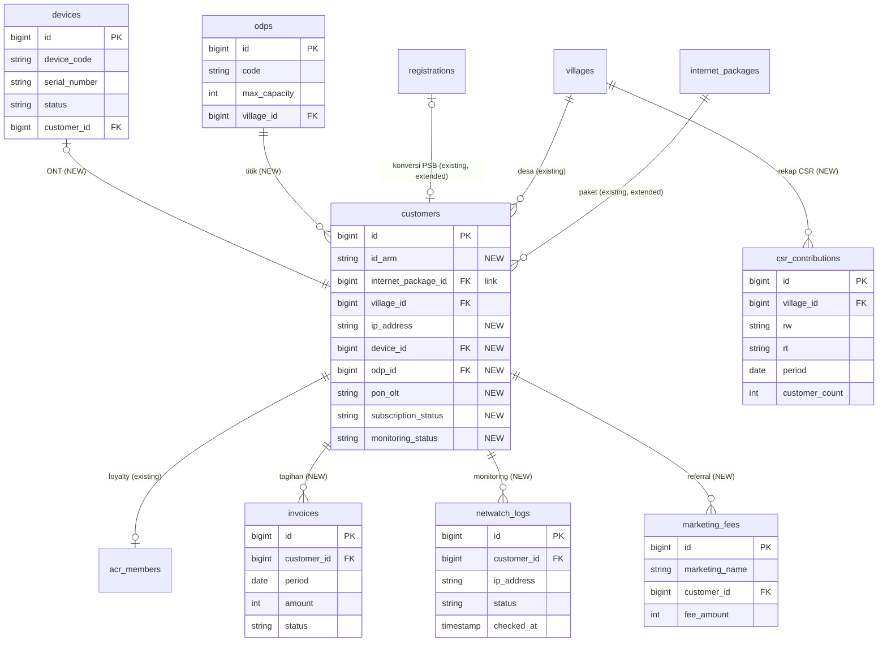

# PRD Tambahan — Modul Operasional ISP (Integrasi ke `armedia-laravel`)

**Konteks:** dokumen ini melengkapi proyek **Armedia Portal (`armedia-laravel`)** yang sudah berjalan. Tujuannya menambahkan modul operasional ISP (data teknis pelanggan, perangkat ONT, ODP, tagihan, monitoring, CSR, fee marketing) dari file master Excel ke dalam repo yang sama — **tanpa menyentuh** modul yang sudah ada (CMS, registrasi WiFi, dashboard ACR member, API Next.js).

**Prinsip utama: ANTI-BUG.**
1. **Additive-only.** Migrasi hanya *menambah* tabel baru atau *menambah kolom nullable* ke tabel lama. **Tidak pernah** drop/rename/ubah kolom existing.
2. **Reuse dulu, baru buat.** Jika entitas sudah ada (`internet_packages`, `registrations`, `villages`, `customers`), **perluas**, jangan bikin tabel/Resource kembar.
3. **Satu panel.** Semua modul ISP masuk sebagai Resource baru di panel Filament `/admin` yang sudah ada, dikelompokkan dalam navigation group `Operasional ISP` dan `Jaringan & Monitoring`. **Tidak** membuat panel/auth kedua.
4. **Jangan sentuh jalur publik.** Route Inertia (`/`, `/daftar`, `/dashboard`), Filament yang lama, dan API Next.js (`/api/...`) tetap utuh. Kalau butuh endpoint baru, tambahkan terpisah dengan CORS mengikuti pola existing.

---

## 0. WAJIB DILAKUKAN DULU — Audit Skema Existing

Beberapa nama kolom/tabel di proyekmu belum saya ketahui isinya persis. **Sebelum menulis migrasi apa pun**, jalankan ini untuk melihat struktur nyata, supaya tidak tabrakan nama kolom:

```bash
# lihat kolom tabel yang mau di-extend
php artisan db:table customers
php artisan db:table internet_packages
php artisan db:table registrations
php artisan db:table villages
php artisan db:table acr_members

# lihat daftar Filament Resource yang SUDAH ada (hindari duplikat)
ls -la app/Filament/Resources
php artisan model:show Customer
```

**Tiga hal yang harus dikonfirmasi dari hasil audit** (menentukan REUSE vs CREATE):
| Cek | Kalau SUDAH ada | Kalau BELUM ada |
|---|---|---|
| Tabel `customers` + `CustomerResource` | **Extend** (tambah kolom teknis + field di Resource yang ada) | **Create** `customers` sebagai master pelanggan aktif |
| Kolom `status` di `customers` | pakai nama baru `subscription_status` biar tak bentrok | boleh pakai `subscription_status` |
| `internet_packages` = paket ARMED/HEROIK? | tambah kolom teknis + seed yang kurang | tambah kolom teknis + seed semua |

> Semua nama kolom di PRD ini adalah *usulan*. Kalau audit menunjukkan kolom dengan makna sama sudah ada, **pakai yang existing** dan lewati penambahannya.

---

## 1. Peta Entitas: Reuse / Extend / Create

| Data (dari Excel / kebutuhan ISP) | Entitas di `armedia-laravel` | Aksi |
|---|---|---|
| Paket ARMED 10–200 & HEROIK 10–150 (`4_Produk`) | `internet_packages` | **EXTEND** — tambah `code`, `brand`, `speed_mbps`, `ip_allocation`; seed entri yang belum ada |
| Calon / PSB (`1_Calon_Pelanggan`) | `registrations` | **EXTEND** — tambah field PSB + tombol "Konversi ke Pelanggan" |
| Master pelanggan aktif (`2_Data_Pelanggan`) | `customers` (existing/baru) | **EXTEND/CREATE** — tambah field teknis ISP |
| Desa/Kecamatan | `villages` | **REUSE** — FK dari `customers` |
| Loyalty / poin | `acr_members` | **REUSE** — tetap 1:1 ke customer, tak diubah |
| Perangkat ONT (`3_Perangkat`) | — | **CREATE** `devices` |
| Titik ODP (`8_Master_ODP`) | — | **CREATE** `odps` |
| Tagihan bulanan (`10_Tagihan_Bulanan`) | — | **CREATE** `invoices` |
| Monitoring Netwatch (`9_Monitoring_Netwatch`) | — | **CREATE** `netwatch_logs` |
| Rekap CSR (`5_Rekap_CSR`) | — | **CREATE** `csr_contributions` (dihitung otomatis) |
| Fee marketing (`6_Marketing`) | — | **CREATE** `marketing_fees` |

---

## 2. Perubahan Skema

### 2.1 Kolom tambahan (migrasi ADDITIVE, semua `nullable`)

**`add_isp_fields_to_customers_table`** — cek dulu mana yang sudah ada, tambahkan sisanya:
```
id_arm            string  unique nullable   // ARM-0001
id_lama           string  nullable          // G-152260...
internet_package_id  FK internet_packages nullable
village_id        FK villages nullable      // kalau belum terhubung
rw                string  nullable
rt                string  nullable
ip_address        string  nullable          // 10.152.6.30
device_id         FK devices nullable
odp_id            FK odps nullable
pon_olt           string  nullable          // 1/1/3:2
cable_length_m    integer nullable
activated_at      date    nullable
subscription_status string nullable         // aktif|berhenti|isolir (pakai nama ini bila 'status' sudah dipakai)
monitoring_status   string nullable         // up|down|unknown
monitoring_checked_at timestamp nullable
```

**`add_technical_fields_to_internet_packages`**:
```
code           string unique nullable   // AR-2, HR-11
brand          string nullable          // ARMED | HEROIK
speed_mbps     integer nullable
ip_allocation  string nullable          // 10.152.6-10.152.7
```

**`add_psb_fields_to_registrations`**:
```
report_no             string nullable   // PSB15226062701
jadwal_pasang         date   nullable
marketing             string nullable
target_odp_id         FK odps nullable
pipeline_status       string nullable   // belum|survey|terjadwal|terpasang|batal
converted_customer_id FK customers nullable
```

### 2.2 Tabel baru

```
odps
  id, code (unique, "1/1/3"), max_capacity int null, village_id FK villages null,
  status string null, notes text null, timestamps

devices
  id, device_code (unique, "PG-1522602001"), name ("XPON ONT"), model ("F680C"),
  serial_number (unique null, "HWTC..."), batch_month_year string null,
  status ("terpasang|stok|rusak"), customer_id FK customers null, timestamps

invoices
  id, customer_id FK, period date ("2026-01-01"), amount int,
  status ("belum|lunas|gratis|tidak_tertagih"), paid_at date null,
  payment_method string null, notes text null, timestamps
  UNIQUE(customer_id, period)

netwatch_logs
  id, customer_id FK null, ip_address string, status ("up|down"),
  checked_at timestamp, timestamps

csr_contributions
  id, village_id FK null, rw string null, rt string null, period date,
  customer_count int, csr_total int, desa_share int, rt_share int, timestamps

marketing_fees
  id, marketing_name string, location string null, customer_id FK null,
  client_name string null, fee_amount int, status string null, timestamps
```

### 2.3 ERD (fokus: baru + relasi ke existing)



---

## 3. Struktur Folder — File yang DITAMBAHKAN

Mengikuti struktur `armedia-laravel` yang sudah ada. **(NEW)** = buat baru, **(EXTEND)** = tambahkan isi ke file existing, jangan tulis ulang.

```
app/
├── Enums/                                    (NEW semua)
│   ├── CustomerSubscriptionStatus.php        // aktif, berhenti, isolir
│   ├── DeviceStatus.php                       // terpasang, stok, rusak
│   ├── InvoiceStatus.php                       // belum, lunas, gratis, tidak_tertagih
│   ├── PackageBrand.php                         // armed, heroik
│   └── MonitoringStatus.php                     // up, down, unknown
├── Models/
│   ├── Device.php  Odp.php  Invoice.php  NetwatchLog.php  CsrContribution.php  MarketingFee.php   (NEW)
│   ├── Customer.php          (EXTEND) + relasi: package(), village(), device(), odp(), invoices(), netwatchLogs() + casts enum
│   ├── InternetPackage.php   (EXTEND) + cast brand, accessor label, relasi customers()
│   └── Registration.php      (EXTEND) + relasi convertedCustomer(), targetOdp() + action konversi
├── Filament/Resources/
│   ├── DeviceResource.php  OdpResource.php  InvoiceResource.php  MarketingFeeResource.php   (NEW)
│   │     └─ (masing-masing + Pages/ standar Filament)
│   ├── CustomerResource.php        (EXTEND jika ada; kalau belum, NEW)
│   │     └─ tambah field teknis di form + kolom di table + RelationManagers/InvoicesRelationManager.php (NEW)
│   ├── InternetPackageResource.php (EXTEND) tambah field code/brand/speed/ip_allocation
│   └── RegistrationResource.php    (EXTEND) tambah field PSB + Action "Konversi ke Pelanggan"
├── Filament/Pages/                           (NEW)
│   ├── NetwatchImport.php    // halaman paste/upload export Netwatch → auto-match
│   └── CsrReport.php          // laporan CSR per desa/RW/RT/bulan
├── Filament/Widgets/                         (NEW)
│   ├── IspStatsOverview.php       // pelanggan aktif, terpasang vs stok, estimasi pendapatan, pelanggan DOWN
│   ├── OfflineCustomersTable.php  // daftar pelanggan status monitoring = down
│   └── PackageDistributionChart.php
├── Services/                                 (NEW)
│   ├── NetwatchMatchingService.php  // cocokkan IP → customer, tulis log + update monitoring_status
│   ├── CsrCalculatorService.php     // hitung CSR: 3000/plgn → desa 1000 + rt 2000
│   ├── InvoiceGeneratorService.php  // generate tagihan sebulan utk semua pelanggan aktif
│   └── OdpCapacityService.php       // hitung port terpakai & sisa slot per ODP
├── Imports/                                  (NEW) — pakai Filament Excel / maatwebsite yang sudah terpasang
│   ├── CustomerImport.php  DeviceImport.php  OdpImport.php  PackageImport.php  RegistrationImport.php
└── Console/Commands/
    └── ImportArmediaMaster.php   (NEW) — php artisan armedia:import path/master.xlsx

database/
├── migrations/                               (NEW, urutan lihat §5)
│   ├── ..._create_odps_table.php
│   ├── ..._create_devices_table.php
│   ├── ..._add_technical_fields_to_internet_packages.php
│   ├── ..._add_isp_fields_to_customers_table.php
│   ├── ..._add_psb_fields_to_registrations_table.php
│   ├── ..._create_invoices_table.php
│   ├── ..._create_netwatch_logs_table.php
│   ├── ..._create_csr_contributions_table.php
│   └── ..._create_marketing_fees_table.php
└── seeders/                                  (NEW)
    ├── InternetPackageSeeder.php   // seed ARMED/HEROIK — cek existing dulu (updateOrCreate by code)
    └── OdpSeeder.php               // seed 16 ODP dari Excel (updateOrCreate by code)

resources/js/            → TIDAK DISENTUH (Inertia/React member dashboard tetap)
routes/                  → TIDAK DISENTUH (Inertia + API Next.js tetap)
```

---

## 4. Aturan Anti-Bug per Area

**Filament Resources**
- Sebelum bikin `CustomerResource`, cek `app/Filament/Resources`. Kalau sudah ada → **tambah** `Forms\Components` & `Columns` di file itu, jangan buat resource kedua (dua resource untuk satu model = menu dobel + konflik).
- Kelompokkan menu: set `protected static ?string $navigationGroup = 'Operasional ISP';` (Pelanggan, Calon, Tagihan, Paket, Marketing) dan `'Jaringan & Monitoring';` (Perangkat, ODP, Netwatch, CSR). Rapi & tak bercampur menu CMS/ACR.

**Permissions (Shield sudah terpasang)**
- Setelah menambah Resource, jalankan `php artisan shield:generate --all` untuk membuat permission resource baru. Ini **menambah**, tidak menimpa permission lama.
- Assign permission baru ke role yang relevan (owner/admin/teknisi/marketing) lewat panel Shield. Jangan edit permission existing.

**Model**
- Di `Customer.php`, **tambahkan** method relasi & `$casts` untuk enum. Jangan hapus `$fillable`/relasi lama — tambahkan field baru ke `$fillable` saja.

**Migrasi**
- Selalu `Schema::table(...)` dengan `->nullable()` untuk kolom baru di tabel lama. Tidak ada `dropColumn`/`change()` pada kolom existing.
- Foreign key baru pakai `->nullOnDelete()` agar hapus data referensi tidak menggagalkan baris pelanggan.

**Jangan diubah**
- `resources/js/Pages/*` (dashboard ACR member), semua route Inertia & `/api/*` Next.js, tabel `acr_*`, `articles`, `testimonials`, `web_settings`, `contact_messages`.

---

## 5. Urutan Migrasi & Import

**Urutan `php artisan migrate`** (karena FK):
1. `create_odps_table`
2. `create_devices_table`
3. `add_technical_fields_to_internet_packages`
4. `add_isp_fields_to_customers_table` (butuh odps & devices sudah ada)
5. `add_psb_fields_to_registrations_table` (butuh odps & customers)
6. `create_invoices_table` · `create_netwatch_logs_table` · `create_marketing_fees_table` · `create_csr_contributions_table`

**Import data Excel** (pakai Filament Excel / maatwebsite yang sudah ada) — urut:
1. `internet_packages` (seed/updateOrCreate by `code`) → 2. `odps` → 3. `devices` → 4. `customers` (map `Produk ID`→package, `Perangkat ID`→device + set `devices.customer_id`, `ODP`→odp) → 5. `registrations` (calon) → 6. `invoices` (unpivot kolom Jan–Des jadi baris per bulan).

**Pembersihan wajib saat import** (dari kondisi data asli):
- Trim spasi desa: `"GUMELAR "`, `"CIHONJE "` → tanpa spasi (ada 8 varian desa yang sebenarnya duplikat spasi). Map ke `villages` yang sudah ada.
- Normalisasi HP (buang spasi; nilai tak valid seperti `"08"` → null).
- Tandai duplikat nama/HP untuk verifikasi manual (panduan Excel menyebut ada kemungkinan duplikat).

```bash
php artisan migrate
php artisan db:seed --class=InternetPackageSeeder
php artisan db:seed --class=OdpSeeder
php artisan armedia:import storage/app/import/master.xlsx
php artisan shield:generate --all
```

---

## 6. Fitur Otomatis (menggantikan formula Excel)

- **Port ODP terpakai**: `OdpCapacityService` menghitung dari jumlah customer aktif per ODP → badge hijau/kuning/merah. Bukan kolom manual.
- **CSR**: `CsrCalculatorService` — Rp3.000/pelanggan aktif/bulan → Desa Rp1.000 + RT Rp2.000, dikelompokkan per desa/RW/RT/bulan. Simpan snapshot ke `csr_contributions`.
- **Tagihan**: `InvoiceGeneratorService` — aksi "Generate tagihan bulan X" membuat invoice semua pelanggan aktif dengan harga paket saat itu (snapshot di `invoices.amount`).
- **Monitoring**: `NetwatchMatchingService` — paste export Netwatch → cocokkan IP ke `customers`, tulis `netwatch_logs`, update `monitoring_status`. Widget menampilkan daftar pelanggan DOWN + nama/desa/WA untuk follow-up.

---

## 7. (Opsional, Fase Lanjut) Sambungan ke Member Dashboard & API
Setelah operasional stabil, `monitoring_status` dan tagihan pelanggan bisa ditarik ke dashboard ACR member (Inertia) atau diekspos sebagai endpoint `/api/customer/{id}/status` — **ditambahkan terpisah**, mengikuti pola CORS API yang sudah ada, tanpa mengubah endpoint lama.

---

## 8. Checklist Anti-Bug Sebelum Deploy
- [ ] Sudah `db:table` semua tabel yang di-extend; tidak ada nama kolom bentrok.
- [ ] Tidak ada `CustomerResource` / model kembar.
- [ ] Semua migrasi additive (`nullable`, tanpa drop/change kolom lama).
- [ ] `php artisan migrate` jalan bersih di DB lokal (Sail/Docker) sebelum push.
- [ ] `shield:generate` dijalankan; permission baru ter-assign, permission lama utuh.
- [ ] Route Inertia & `/api/*` Next.js diuji tetap normal setelah migrasi.
- [ ] Import Excel diuji di DB lokal dulu; verifikasi jumlah: ±169 customer, ±306 device, 15 paket, 16 ODP.
- [ ] Deploy lewat pipeline `armedia-laravel` yang sudah ada (GitHub → Coolify). Migrasi additive aman dijalankan di produksi (`migrate --force`).

> Catatan: karena runtime proyekmu **PHP 8.4**, gunakan environment build yang sudah ada di `armedia-laravel` (jangan pakai Dockerfile PHP 8.3 dari draft sebelumnya). Modul ISP ini ikut deploy di app & pipeline yang sama, cukup jalankan migrasi additive saat rilis.
